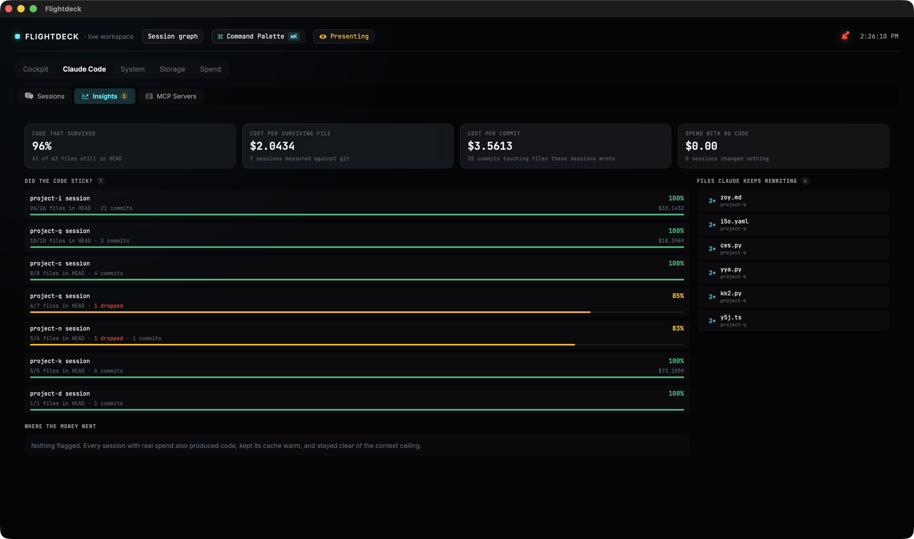
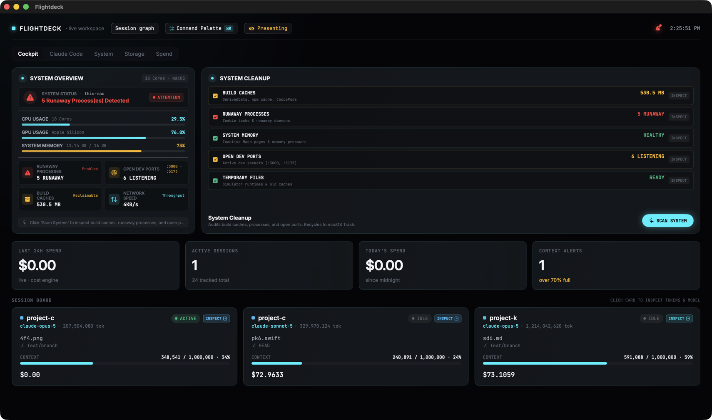
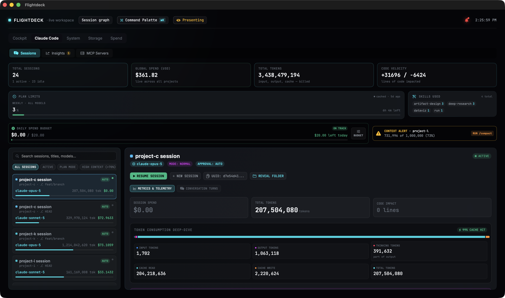
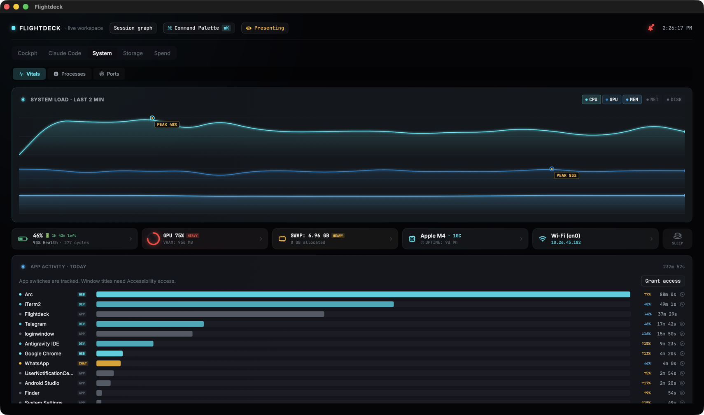
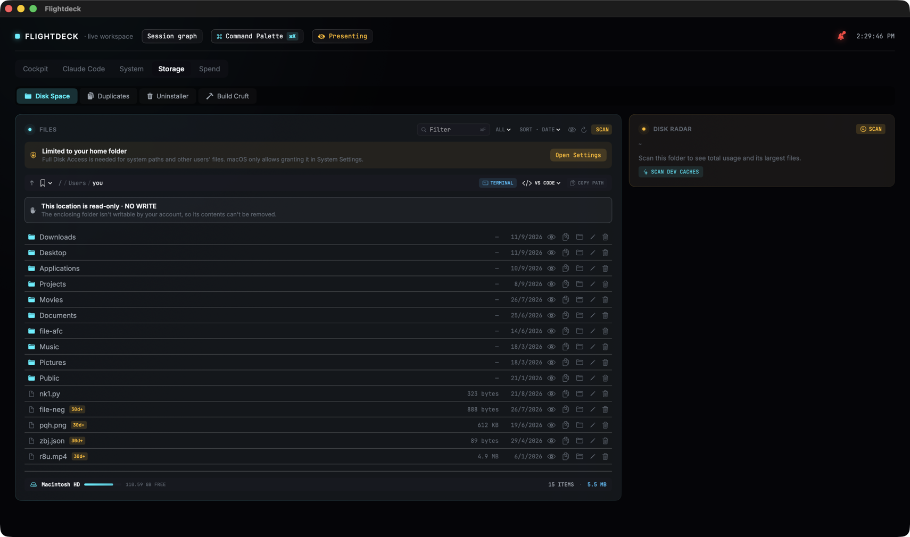

# Flightdeck

**A macOS activity monitor that measures what your Claude Code spend actually produced.**

A usage meter stops at the invoice. Flightdeck reads your Claude Code transcripts *and* the
git history of the repos they touched, so it can tell you how much of what the agent wrote
is still in `HEAD` — and what each surviving file cost.

It is also a full system monitor: CPU and memory straight from the Mach kernel, every
listening port, what is draining the battery, and where the disk went.

```sh
brew tap Jackpkn/flightdeck
brew trust jackpkn/flightdeck
brew install flightdeck
```

Then run `flightdeck`. No security warning, nothing to bypass — see
[why that works](#why-brew-installs-cleanly).

macOS 14+ · Universal (Apple silicon + Intel) · MIT licensed · no account, no telemetry

<sub>Prefer a DMG? [Download the latest release](https://github.com/Jackpkn/Flightdeck-releases/releases/latest)
— but macOS will block it on first launch, because a browser download gets quarantined. The
[Install](#install) section explains how to get past that, and why `brew` avoids it entirely.</sub>

---

## Cost per outcome

Every other tool can tell you what you spent. This is the part that needs the repository on
disk, which is why a cloud dashboard cannot compute it: Flightdeck matches the files each
session wrote against `git`, then divides the real spend by what survived.



**Code survival** is the headline: of 63 files these sessions wrote, 60 are still in `HEAD`.
**Churn hotspots** on the right are files Claude keeps coming back to — usually where the
codebase needs better docs or a `CLAUDE.md` rule.

## Everything at a glance



## Session forensics

Full conversation turns, tool timeline, per-model token and cost breakdown, plan limits with
reset countdowns, and one-click resume of any session in your terminal.



## The machine underneath





---

## Every number is measured, or it is marked

Monitoring tools quietly invent numbers: a burn rate extrapolated from two samples, a context
gauge pinned to a window size it assumed. Flightdeck marks anything it cannot attribute
exactly, and deletes what it cannot measure honestly at all.

| | |
|---|---|
| `≤` | **At most this much.** A windowed spend whose baseline snapshot predates the window. |
| `≥` | **At least this much.** A total including a model with no published price, so it is a floor. |
| `cached · 5d ago` | **Measured, but not now.** Plan limits come from Claude Code's own cache, refreshed only while a session runs. A stale reading is badged, and never triggers an alert. |
| *removed* | **Burn rate, and three others.** They could not be computed without inventing the inputs, so they are gone rather than decorative. |

> **About these screenshots:** they were taken in **presentation mode** (⇧⌘P), which replaces
> project names, session titles, branches and file paths with neutral labels — hence
> `project-c` and `file.py`. Every figure shown is real and unmodified. Masking a number would
> make a shared screen a lie, which is the opposite of the point.

---

## Install

### Recommended: Homebrew

```sh
brew tap Jackpkn/flightdeck
brew trust jackpkn/flightdeck
brew install flightdeck
```

Then run `flightdeck`. To get it into Spotlight and the Dock as well:

```sh
ln -sfn "$(brew --prefix flightdeck)/Flightdeck.app" /Applications/Flightdeck.app
```

`brew trust` is Homebrew's own safety check for third-party taps, added in Homebrew 6. It is
not specific to this tap.

### Why brew installs cleanly

macOS attaches a `com.apple.quarantine` flag to files, and **Gatekeeper only blocks files
carrying that flag**. The flag is applied by whatever fetched the file — browsers set it,
`curl` does not. Homebrew formulas download with `curl`, so the app never carries it and
Gatekeeper never engages, even though Flightdeck is not notarised with a paid Apple Developer
certificate.

It has to be a *formula* rather than a *cask* for this to work: Homebrew 6 removed
`--no-quarantine`, so casks always quarantine.

### The DMG

A browser download does get quarantined, so macOS blocks it. After dragging Flightdeck to
Applications, run this once:

```sh
xattr -dr com.apple.quarantine /Applications/Flightdeck.app
```

That removes the download-origin flag. It says nothing about the code — the bundle is signed
and verifies cleanly (`codesign --verify --deep --strict` reports *valid on disk* and
*satisfies its Designated Requirement*); it is un-notarised, not damaged. Only ever run that
on software you meant to download.

<details>
<summary><b>Without Terminal (macOS 15 Sequoia and later)</b></summary>

<br>

1. Double-click **Flightdeck**. macOS blocks it — click **Done**.
2. Open **System Settings → Privacy & Security**, scroll to **Security**, and click
   **Open Anyway** next to the message about Flightdeck.
3. Authenticate, then confirm.

> Control-clicking the app and choosing **Open** no longer works on macOS 15 or later.
> Apple removed that bypass; the route above replaced it.

</details>

## Privacy

No account, no telemetry, no network calls of its own. Flightdeck reads local files and runs
`git` in your repositories:

```
read   ~/.claude/projects/**/*.jsonl
read   ~/.claude.json
read   git history of repos a session touched
write  ~/.claude/settings.json      ← only if you agree, and backed up first
```

The optional statusline and hooks are what let Flightdeck see live context and tool activity.
Connecting them is a single confirmed write, shown to you beforehand, taken with a backup and
an optimistic-concurrency check so a hand edit is never clobbered. Decline it and the app
still works from transcripts alone.

## About this repository

This repo holds **binaries only — no source**. GitHub release assets inherit their
repository's visibility, and a download link has to work without a token.

---

MIT licensed · built with Swift and SwiftUI
